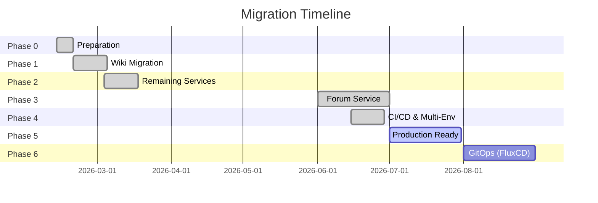

# Migration Strategy

> Step-by-step migration plan from Docker Compose to Kubernetes for wetfish web-services.

---

## Migration Overview

### Original State: Docker Compose (legacy Vultr host)

```
Docker Host (149.28.239.165, now decommissioned — rollback only)
├── Traefik (reverse proxy)
├── Wiki (custom PHP + MariaDB)
├── Forum (SMF PHP + MariaDB)
├── Home (static site)
├── Danger (JavaScript sandbox)
├── Glitch (PHP)
└── Click (tracking service)
```

### Target State: Kubernetes

```
k3d (dev) / k3s (staging, prod)
├── wetfish-system      (Traefik, cert-manager, infra)
├── wetfish-dev         (applications — local k3d)
├── wetfish-staging     (applications — staging)
└── wetfish-prod        (applications — production)
```

> **Observability** is handled by [FishVision](https://github.com/wetfish/FishVision) (a separate repo). This repo no longer ships a monitoring stack — Traefik exposes metrics at `:8082/metrics`, which FishVision's Prometheus scrapes.

---

## Migration Phases

### Phase 0: Preparation ✅

**Goal**: Set up development environment and tools

#### Tasks
- [x] Install k3d and configure development cluster
- [x] Set up local container registry (k3d registry on :5000)
- [x] Create Kubernetes manifests structure
- [x] Document all current service configurations

#### Deliverables
- Functional k3d cluster (1 server, 2 agents)
- Service manifest structure (`services/<name>/k8s/`)
- Setup and deployment scripts

> Originally included a `monitoring/` Helm values directory; this was removed when FishVision became the source of truth.

---

### Phase 1: Pilot Service - Wiki ✅

**Goal**: Successfully migrate one service end-to-end

#### Tasks
- [x] Analyze current Docker Compose wiki configuration
- [x] Containerize wiki (custom PHP app, NOT MediaWiki)
- [x] Create Kubernetes manifests (sidecar pattern: nginx + php-fpm)
- [x] Set up MariaDB 10.10 with persistent storage
- [x] Validate service functionality via Traefik ingress

#### Deliverables
- Wiki service running at `wiki.wetfish.local:8080`
- GitHub Actions CI/CD workflows for wiki images
- Sidecar pattern established as template for PHP services

---

### Phase 2: Remaining Services ✅

**Goal**: Migrate home, glitch, click, and danger

#### Tasks
- [x] Home: Node 20 build → static nginx site
- [x] Glitch: PHP 5.6 + nginx sidecar (no database)
- [x] Click: PHP 5.6 + nginx sidecar + MariaDB 10.10
- [x] Danger: PHP 5.6 + nginx sidecar + MariaDB 10.10
- [x] Update setup-hosts.sh with new service DNS entries
- [x] Update all documentation

#### Deliverables
- 5 services running in k3d cluster
- All services accessible via Traefik ingress
- PHP 5.6 services using `php:5.6-fpm-alpine` base image

#### Key Decisions
- Used `php:5.6-fpm-alpine` instead of broken Sury PHP 5.6 repos
- MariaDB configs require explicit `collation-server` matching `character-set-server`
- Forum (SMF 2.1.6) was initially deferred due to complexity, then delivered in Phase 3

---

### Phase 3: Forum Service ✅

**Goal**: Migrate SMF 2.1.6 forum

#### Tasks
- [x] Analyze SMF 2.1.6 build chain (PHP 8.4, custom mods)
- [x] Create Dockerfiles (`Dockerfile.php`, `Dockerfile.nginx`)
- [x] Create Kubernetes manifests (base + dev/staging/prod overlays)
- [x] Set up MariaDB 10.11 with forum schema
- [x] Validate forum functionality
- [x] Bundle fish avatar + wf-item-econ assets into image
- [x] Serve appdata dirs via nginx alias (avoids symlink complexity)
- [x] CI workflow (`build-forum.yml`) builds from SMF source in CI

#### Deliverables
- SMF 2.1.6 forum with PHP 8.4 + nginx sidecar
- Staging (`testforum.wetfish.net`) and prod overlays
- SMF cache env vars (`FileBased` accelerator) + SMTP env vars via MailVars mod
- Live at `wetfishonline.com` (deployed Aug 13 2026)

---

### Phase 4: CI/CD and Multi-Environment ✅

**Goal**: Full CI/CD pipeline and multi-environment support

#### Tasks
- [x] Restructure manifests into Kustomize base + overlays (dev/staging/prod)
- [x] Add GitHub Actions workflows for all 6 services (reusable workflow pattern)
- [x] Add wetfish-staging and wetfish-prod namespaces
- [x] Update deploy.sh with `--env` flag and Kustomize overlay support
- [x] Update generate-secrets.sh for per-environment secret generation
- [x] Create `up.sh` single bring-up script for full dev stack

#### Deliverables
- Kustomize overlays for 6 services × 3 environments (18 overlays)
- Reusable CI workflow (`.github/workflows/build-service.yml`) + 6 trigger workflows
- `scripts/up.sh` for one-command dev stack bring-up

---

### Phase 5: Production Ready (in progress)

**Goal**: Security hardening, backups, production cluster

#### Tasks
- [ ] Address security audit findings (see `docs/security-audit-action-items.md`)
- [ ] Implement TLS/HTTPS enforcement (cert-manager deployed; forced HTTP→HTTPS redirect pending)
- [ ] Replace hardcoded secrets with sealed secrets or external secret store
- [~] Add network policies (dev only — `infrastructure/network-policies/wetfish-dev.yaml`)
- [ ] Add security contexts to deployments (services currently run as root)
- [ ] Implement backup and restore procedures (manual mysqldump only)
- [x] Deploy to staging environment and validate

---

### Phase 6: GitOps (in progress)

**Goal**: GitOps automation

#### Tasks
- [x] Migrate SMF 2.1.6 forum service (delivered in Phase 3)
- [~] FluxCD scaffolding (`clusters/` + `scripts/bootstrap-flux.sh`)
- [ ] FluxCD rollout live (currently staging/prod managed by manual `kubectl`)
- [ ] Automated promotion to production

---

## Service Migration Details

### Wiki Service Migration

#### Original Architecture
```yaml
Docker Compose:
  wiki-web:
    image: wiki:latest
    ports: ["8080:80"]
    volumes: ["./data:/var/www/html"]

  wiki-db:
    image: mariadb:10.10
    environment:
      MYSQL_DATABASE: wiki
      MYSQL_USER: wiki
      MYSQL_PASSWORD: ${WIKI_DB_PASSWORD}
    volumes: ["./db:/var/lib/mysql"]
```

#### Target Architecture
```yaml
Kubernetes:
  - Namespace: wetfish-dev
  - Deployment: wiki-web (nginx + PHP-FPM sidecar)
  - Service: wiki-web (ClusterIP)
  - Ingress: wiki-ingress (Traefik)
  - ConfigMap: wiki-nginx-config, wiki-php-config
  - Secret: wiki-mysql-secret
  - PVC: wiki-wwwroot (2Gi), wiki-uploads (5Gi)
  - Deployment: wiki-mysql (MariaDB 10.10)
  - Service: wiki-mysql
  - PVC: wiki-mysql-data (2Gi)
```

#### Migration Steps
1. **Data Analysis**
   ```bash
   # Export current data
   docker exec wiki-db mysqldump -u root -p wiki > wiki-backup.sql

   # Analyze file structure
   docker exec wiki-web find /var/www/html -type f | head -20
   ```

2. **Container Creation**
   ```bash
   # Build custom wiki image
   docker build -t wetfish/wiki:k8s-v1 services/wiki/

   # Tag for local registry
   docker tag wetfish/wiki:k8s-v1 localhost:5000/wetfish/wiki:k8s-v1
   docker push localhost:5000/wetfish/wiki:k8s-v1
   ```

3. **Kubernetes Deployment**
   ```bash
   # Deploy database first
   kubectl apply -k services/wiki/k8s/overlays/dev/

   # Load schema on first deploy
   kubectl exec -i deployment/wiki-mysql -n wetfish-dev -- \
     mysql -uroot -pwikipass wikidb < services/wiki/src/wwwroot/src/schema.sql
   ```

### Forum Service Migration ✅

#### Target Architecture
- SMF 2.1.6 (Simple Machines Forum) — PHP 8.4 application
- MariaDB 10.11 backend
- nginx + php-fpm sidecar pattern (same as other PHP services)
- Appdata dirs (Themes, Packages, etc.) served via nginx alias, sourced from PVC

#### Migration Notes
- Complex build chain (composer, custom SMF mods); CI downloads SMF 2.1.6 source and builds from it
- Fish avatar + wf-item-econ assets bundled directly into the image
- `Settings.php` cache config driven by env vars (`SMF_CACHE_ENABLE`, `SMF_CACHE_ACCELERATOR=FileBased`, `SMF_CACHE_DIR`)
- SMTP driven by the MailVars mod env vars (`SMF_MAIL_TYPE`, `SMF_SMTP_HOST`, etc.)
- Database migration handled by Firedoll's SQL pipeline (see `docs/forum-deployment-runbook.md`)

### Static Sites (Home) Migration

Home is a SvelteKit app built in a Node 20 builder stage, with the resulting static output served by nginx:

```yaml
Approach:
  1. Build: node:20 builder -> npm install + npm run build
  2. Serve: nginx:1.25-alpine serving the built public_html

Benefits:
  - Immutable, versioned container image
  - Consistent with other services' nginx serving
  - Routed by Traefik ingress
```

---

## Data Migration Strategy

### Database Migration Process

#### General Approach
1. **Export** data from running containers
2. **Backup** entire data directory
3. **Import** into Kubernetes pods
4. **Validate** data integrity
5. **Switch** traffic to new deployment

#### Migration Script
```bash
#!/bin/bash
# migrate-wiki-db.sh

set -euo pipefail

NAMESPACE="wetfish-dev"
BACKUP_FILE="wiki-backup-$(date +%Y%m%d).sql"

echo "Starting wiki database migration..."

# 1. Export data from Docker Compose
echo "Exporting data from Docker Compose..."
docker-compose exec -T wiki-db mysqldump -u root -p"$WIKI_ROOT_PASSWORD" wiki > "$BACKUP_FILE"

# 2. Import into Kubernetes database
echo "Importing data into Kubernetes database..."
kubectl exec -i deployment/wiki-mysql -n "$NAMESPACE" -- \
  mysql -u root -p"$WIKI_ROOT_PASSWORD" wikidb < "$BACKUP_FILE"

# 3. Validate
echo "Validating data migration..."
kubectl exec -i deployment/wiki-mysql -n "$NAMESPACE" -- \
  mysql -u root -p"$WIKI_ROOT_PASSWORD" -e "SELECT COUNT(*) FROM page;" wikidb

echo "Wiki database migration completed!"
```

### File Storage Migration

#### Wiki File Migration
```bash
#!/bin/bash
# migrate-wiki-files.sh

NAMESPACE="wetfish-dev"
WIKI_POD=$(kubectl get pods -n $NAMESPACE -l app=wiki -o jsonpath='{.items[0].metadata.name}')

# 1. Sync files from Docker Compose volume
rsync -av --progress ./wiki-data/ /tmp/wiki-files/

# 2. Copy to Kubernetes pod
kubectl cp /tmp/wiki-files/ "$NAMESPACE/$WIKI_POD:/var/www/html/"

# 3. Set proper permissions
kubectl exec "$NAMESPACE/$WIKI_POD" -- chown -R www-data:www-data /var/www/html/

echo "Wiki files migration completed!"
```

---

## Testing Strategy

### Migration Testing Phases

#### Phase 1: Unit Testing
```yaml
Tests:
  - Container builds successfully
  - Kubernetes manifests are valid
  - Database connections work
  - Configuration loading works
```

#### Phase 2: Integration Testing
```yaml
Tests:
  - Service startup and health checks
  - Database migrations
  - Inter-service communication
  - Ingress routing
```

#### Phase 3: End-to-End Testing
```yaml
Tests:
  - Full user workflows
  - File upload/download
  - User authentication
  - Performance benchmarks
```

#### Phase 4: Load Testing
```yaml
Tests:
  - Concurrent user scenarios
  - Database query performance
  - Resource usage monitoring
  - Memory leak detection
```

### Test Automation
```bash
#!/bin/bash
# test-migration.sh

set -euo pipefail

NAMESPACE="wetfish-dev"

echo "Running migration tests..."

# 1. Check pod status
kubectl wait --for=condition=ready pod -l app=wiki -n $NAMESPACE --timeout=300s

# 2. Test database connectivity
kubectl exec deployment/wiki-web -n $NAMESPACE -c php-fpm -- php -r "
\$pdo = new PDO('mysql:host=wiki-mysql;dbname=wikidb', 'root', 'wikipass');
echo 'Database connection successful';
"

# 3. Test web interface
curl -f http://wiki.wetfish.local:8080/ > /dev/null
echo "Web interface accessible"

echo "All tests passed!"
```

---

## Migration Checklist

### Pre-Migration
- [x] Current system documentation complete
- [ ] Backup strategy validated
- [x] Test environment ready
- [x] Migration scripts written and tested
- [x] Rollback plan documented

### Migration Execution
- [x] Database schemas available (`schema.sql` for wiki, click, danger)
- [x] Containers built and tested (all 6 services)
- [x] Kubernetes manifests applied
- [x] Services validated (HTTP 200 on all endpoints)

### Post-Migration
- [x] Health checks passing (liveness/readiness probes on all pods)
- [x] Observability via FishVision (Traefik metrics scraped by FishVision Prometheus)
- [x] Documentation updated
- [x] Old Docker Compose system decommissioned (149.28.239.165 is rollback-only)
- [ ] Custom alert rules active
- [ ] Backup procedures automated

---

## Rollback Strategy

> The legacy Docker Compose host (149.28.239.165) has been decommissioned and is retained only for rollback. See `SIA/AGENTS.md` for current rollback details.

### Rollback Triggers
- Service health checks failing
- Database corruption detected
- Performance degradation >50%
- Security issues identified

### Rollback Procedure
```bash
#!/bin/bash
# rollback.sh

set -euo pipefail

echo "Starting rollback procedure..."

# 1. Scale down Kubernetes services
kubectl scale deployment wiki-web --replicas=0 -n wetfish-dev

# 2. Restore from backup (if restoring data)
kubectl exec -i deployment/wiki-mysql -n wetfish-dev -- \
  mysql -u root -p"$WIKI_ROOT_PASSWORD" wikidb < wiki-backup.sql

# 3. Scale back up
kubectl scale deployment wiki-web --replicas=1 -n wetfish-dev

echo "Rollback completed!"
```

---

## Migration Timeline



---

## Success Criteria

### Phase 0 Complete ✅
- [x] k3d cluster running with Traefik ingress
- [x] Local registry on port 5000
- [x] Setup, deploy, cleanup, hosts, and test scripts

### Phase 1 Complete ✅
- [x] Wiki service fully functional in K8s (sidecar pattern)
- [x] MariaDB with persistent storage
- [x] GitHub Actions CI/CD workflows

### Phase 2 Complete ✅
- [x] Home, glitch, click, danger services migrated
- [x] All services accessible via Traefik ingress
- [x] Documentation updated

### Phase 3: Forum ✅
- [x] SMF 2.1.6 forum service migrated
- [x] Forum database with schema loaded
- [x] Live at `wetfishonline.com`

### Phase 4: CI/CD & Multi-Environment ✅
- [x] Full CI/CD pipeline for all 6 services (reusable GitHub Actions workflow)
- [x] Multi-environment support (dev/staging/prod Kustomize overlays)
- [x] One-command dev stack bring-up (`scripts/up.sh`)

### Phase 5: Production Ready (in progress)
- [ ] Security audit findings addressed
- [ ] TLS/HTTPS enforced
- [ ] Secrets management implemented
- [ ] Backup procedures validated

### Phase 6: GitOps (in progress)
- [~] FluxCD scaffolding (`clusters/` + `bootstrap-flux.sh`)
- [ ] FluxCD live for staging/prod
- [ ] Automated promotion to production

---

## Tools and Scripts

### Migration Utilities
- `up.sh` — full dev stack bring-up
- `deploy.sh` — per-environment service deployment
- `generate-secrets.sh` — per-environment secret generation
- `bootstrap-flux.sh` — FluxCD bootstrap for staging/prod
- `cleanup.sh` — tear down dev cluster
- `sync-from-vultr.sh` — sync data from legacy Vultr host
- `test-deployment.sh` — health checks

### Observability
Handled by FishVision (separate repo):
- Prometheus metrics (scrapes Traefik `:8082/metrics`)
- Grafana dashboards
- Loki log aggregation
- Tempo distributed tracing

---

*Migration Strategy — last updated Aug 2026*
